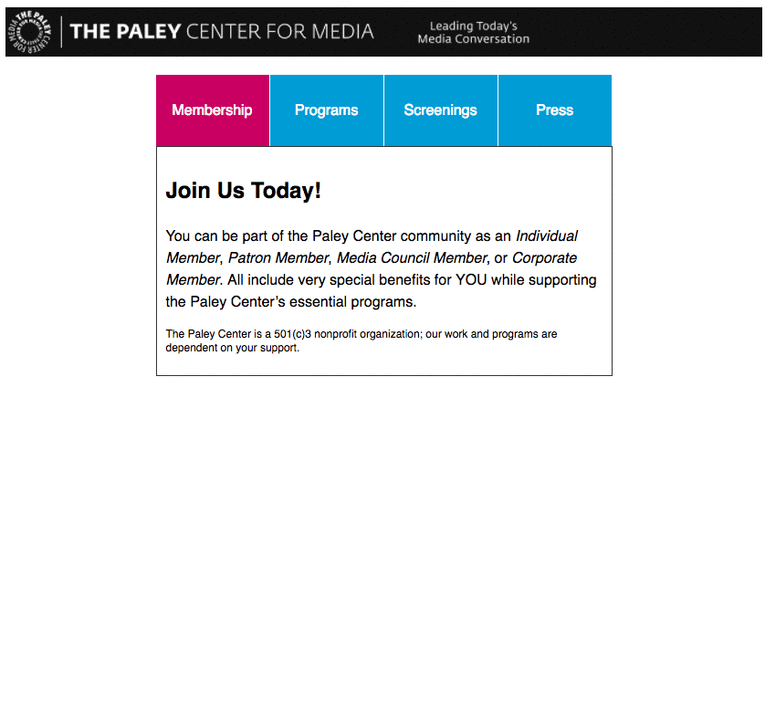
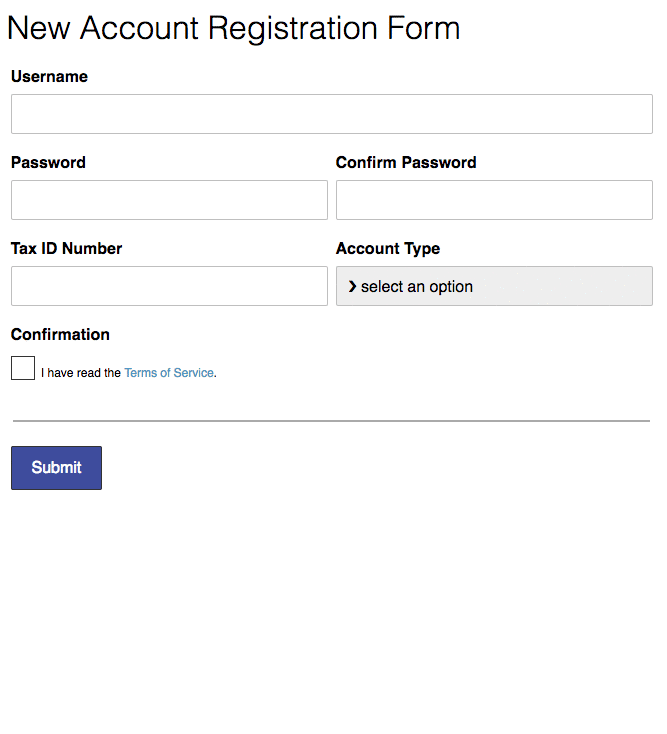

# Interactive UI Components

## Context
In order to become a competent front-end developer, it is a good idea to build common U.I. components. For this lab, you will build two components:
1) user interface tabs that reveal content
2) simple form validation for an account registration.  

---

## Objectives

### Learning Objectives
After completing this assignment you should be able to
- Use javascript to respond to 'click' events and form 'submit' events.
- Use javascript to manipulate elements on the DOM.
- Use programming logic inside your event-handlers to give accurate user feedback.

### Performance Objectives
- Reasonably good design.
- You should use SCSS.
- You should use vanilla javascript for all event listeners and DOM manipulations


### Deliverables
- an `index.html` file with the interactive functionality 2 pages:
  - `ex-01-ui-tabs.html`
  - `ex-02-form-validation.html`
- a `main.scss` file in a `scss` directory with your styles that compiles to a `style.css` file inside a `css` directory
  - *Note*: the styles for the `ex-02-form-validation` are already complete
- For **UI Tabs**, you must create the HTML markup + CSS styles + JS functionality for the UI Tabs exercise
- For **Form Validation**, you must create the JS functionality as shown in the demo.

---

## Demos

### Exercise 01 - UI Tabs



### Exercise 02 - Job Form Validation


---

## Additional Instructions

#### Setup
1. Create the project folder + download the files

```sh
# (1) Create the folder for the repo, and cd into it
cd ~/muktek/Documents/labs
mkdir lab--interactive-components
cd lab--interactive-components

#(2) download and unzip the project files
curl https://raw.githubusercontent.com/muktek/lab--interactive-components/master/assignment-files.zip > assignment-files.zip
unzip assignment-files.zip

```

2. Link the `.js` files in the `.html` files.
  - your `ex-01-ui-tabs.html` should link to `app-01.js` in a `<script>` tag
  - your `ex-02-form-validation.html` should link to a `app-02.js` in a `<script>` tag
